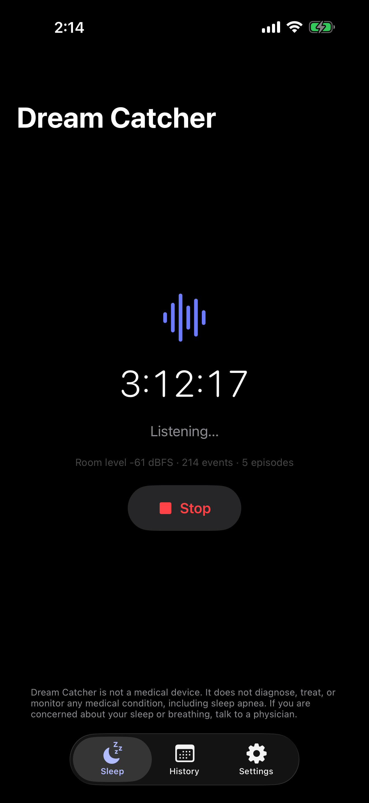
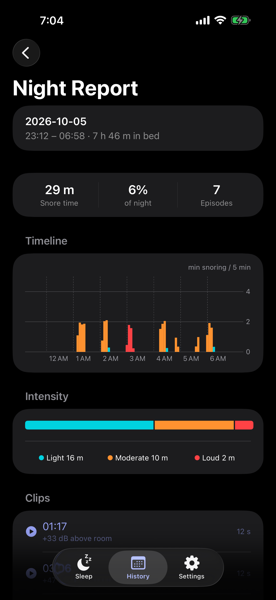
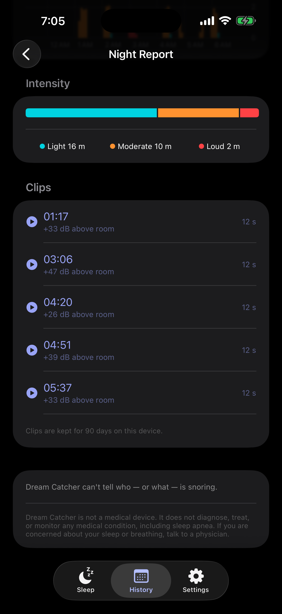
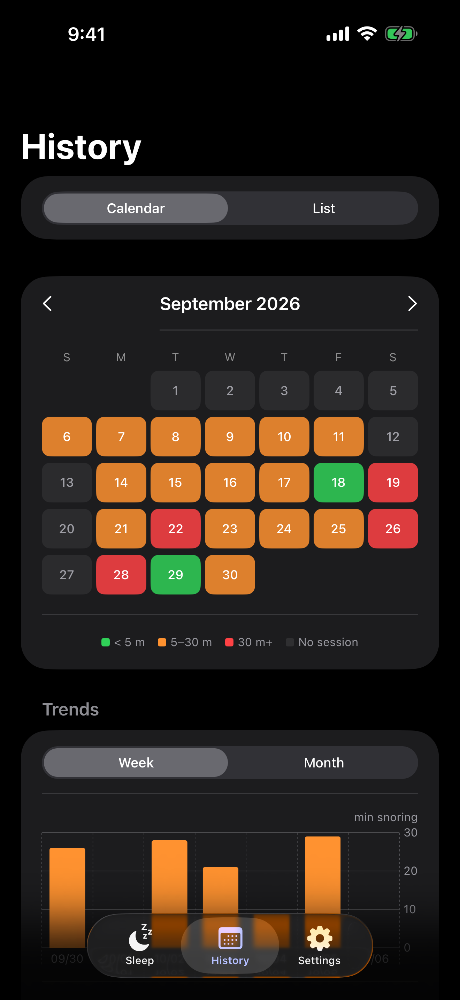
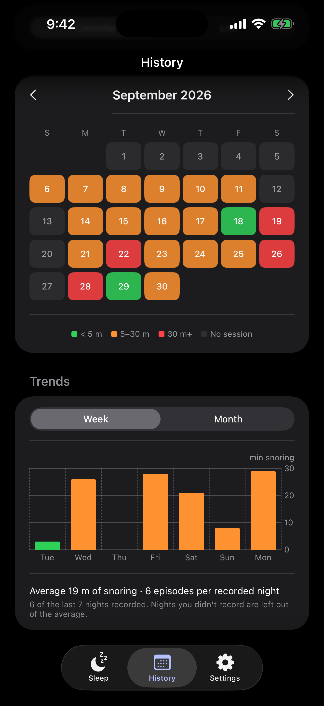

# Dream Catcher

[](https://github.com/waleedrizwan/DreamCatcher/actions/workflows/ci.yml)
[](https://github.com/waleedrizwan/DreamCatcher/releases/latest)

Vibe coded replacement for Snore Labs. Does the same thing. Free.

<p>





</p>

## Get it

App Store: [Dream Catcher: Snore Tracker](https://apps.apple.com/app/id6819872641). It's in review right now, so the link goes live once Apple approves it.

Or grab `DreamCatcher.ipa` from [Releases](https://github.com/waleedrizwan/DreamCatcher/releases/latest) and sideload it with [AltStore](https://altstore.io) or [SideStore](https://sidestore.io). Or open `ios/DreamCatcher.xcodeproj` in Xcode and run it on your phone (iOS 17+).

## For developers

```sh
swift test --package-path ios/Packages/SnoreCore      # snore detector
swift test --package-path ios/Packages/SnoreStorage   # database
```

To release a new version: add notes to [CHANGELOG.md](CHANGELOG.md), bump `MARKETING_VERSION`, then `git tag v0.2.0 && git push origin v0.2.0`. GitHub builds the `.ipa` and publishes the release.

| Folder | What's in it |
|---|---|
| `ios/` | The app (SwiftUI) |
| `spec/` | Exactly how snoring gets detected and counted, plus test fixtures |
| `tools/yamnet/` | Rebuilds the AI model from Google's YAMNet |
| `docs/` | Design notes, privacy policy, App Store prep |

<details>
<summary>How detection works</summary>

### Architecture

Each platform's audio stack (AVAudioEngine / AudioRecord + an on-device sound classifier) is reduced to one normalized stream of `ClassifierFrame { tMs, rmsDbfs, peakDbfs, snoreConf, speechConf }` at 16 kHz mono, 1 s window / 500 ms hop. Everything downstream — the adaptive noise-floor gate, the event/episode state machine, metrics, intensity buckets, timeline binning, clip policy, SQLite schema — is specified once in `spec/` and implemented as a pure, platform-free class in Swift and Kotlin, both proven against the same golden fixtures. See `spec/SHARED_BEHAVIOR_SPEC.md`.

### Detection defaults (v1.1)

Classifier: YAMNet (AudioSet, 521 classes) as a Core ML program run CPU-only — the one path iOS allows a backgrounded, locked-screen app (Apple's built-in SoundAnalysis classifier dies at screen lock; verified on-device 2026-09-19). Windows are peak-normalized before inference; snore threshold 0.35 / strong 0.55 (Medium).

16 kHz mono · 1.0 s window / 500 ms hop · adaptive noise floor (min-follower +0.05 dB/frame) · gate = floor + 12 dB clamped [-56, -38] dBFS · positive = gated AND snoreConf ≥ threshold AND speech veto · event = ≥2 positive frames (or 1 strong) · episode = events merged ≤ 30 s gaps, confirmed at ≥3 events and ≥30 s span · intensity relative to room noise floor (light < +25 dB, moderate +25–40, loud ≥ +40).

</details>

---

Want something that tracks more than snoring? I'm also building [Night Owl](https://github.com/waleedrizwan/NightOwl), a Raspberry Pi bedside tracker.

MIT licensed. YAMNet is Google's, under Apache 2.0 ([NOTICE](NOTICE)).
